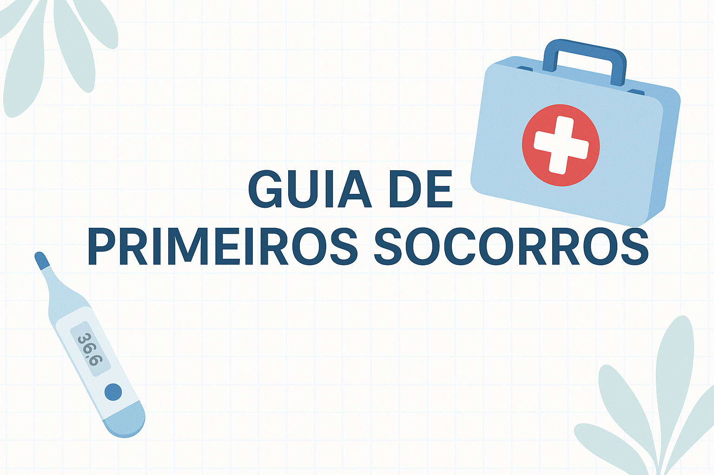
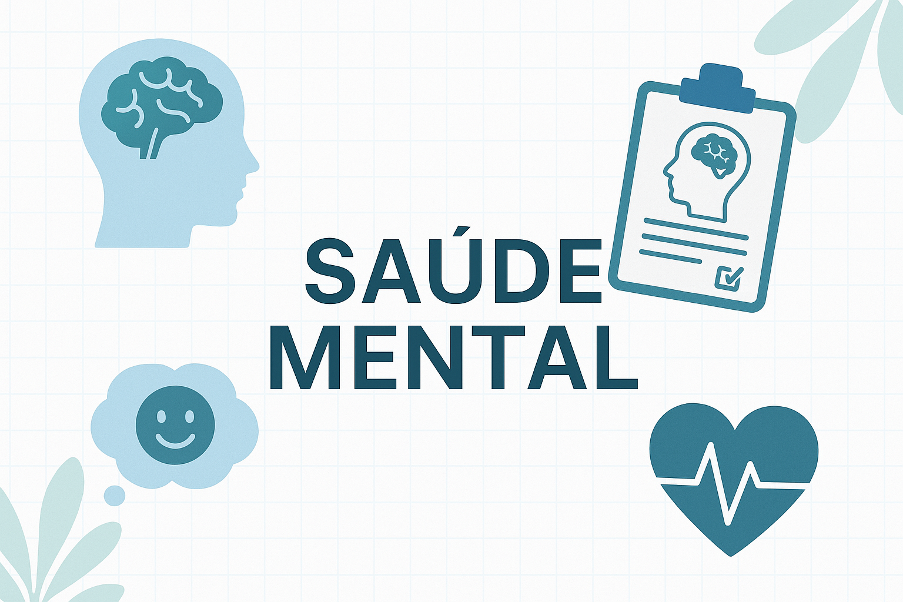

# 🌐 VivaBem - Portal de Saúde

Bem-vindo ao **VivaBem**, um projeto pessoal desenvolvido para meu portfólio com o objetivo de demonstrar habilidades em **HTML, CSS e JavaScript**, além de boas práticas de desenvolvimento web moderno.  

Este projeto foi pensado para ser um **site informativo e interativo sobre saúde física e mental**, com foco em **responsividade, acessibilidade e experiência do usuário**.

---

## ✨ Funcionalidades Principais

- ✅ **Landing page profissional** com design clínico, moderno e chamativo.  
- ✅ **Modo claro e escuro** utilizando `:root` e `data-theme`, com **armazenamento de preferência** no navegador.  
- ✅ **Animações suaves** usando **CSS keyframes** e **Intersection Observer API** para destacar seções conforme o usuário navega.  
- ✅ **Responsividade Mobile First**, garantindo ótima usabilidade em celulares, tablets e desktops.  
- ✅ **Cálculo de IMC (Índice de Massa Corporal)** com feedback visual e informativo.
- ✅ **Guia de Primeiros socorros dividos em cards com modals interativos.    
- ✅ **Página de saúde mental** com destaque para bem-estar, informações e teste de humor.  
- ✅ **Navegação clara e intuitiva**, projetada para guiar o usuário pelos conteúdos de forma simples.  

---

## 📑 Estrutura do Site

O projeto contém páginas e seções que se complementam para criar uma experiência completa:

### 🔹 **1. Home (Landing Page)**
- Apresentação do projeto.
- Destaque dos serviços e seções disponíveis.
- Design moderno e inspirador, transmitindo confiança.
- Informações sobre o objetivo do projeto.  
- Texto institucional destacando o compromisso com a saúde e bem-estar.  
- Contatos fictícios para fins de portfólio:  
  - 📧 contato@vivabem.com  
  - 📞 (11) 98765-4321 
- Logo + slogan.  
- Copyright © 2025 VivaBem.  
- Links úteis para navegação.  

### 🔹 **2. Calculadora IMC**
- Interface amigável para cálculo do índice de massa corporal.  
- Feedback informativo sobre os resultados (abaixo do peso, saudável, sobrepeso, obesidade).  
- Fundo profissional e clínico.  

### 🔹 **3. Guia de Primeiros Socorros**
- Grid layout para organização e melhor responsividade para os cards de emergência.
- Modals interativos para ler as informações de cada card
- Informações detalhadas e resumidas para Primeiros socorros.  

### 🔹 **4. Saúde Mental**
- Conteúdo sobre importância do bem-estar psicológico.  
- Ilustrações e design leve para transmitir calma.  
- **Teste de humor interativo**, permitindo ao usuário avaliar como se sente no momento. 

---

## 🎨 Design e Experiência do Usuário

- **Paleta de cores** inspirada em tons de azul (#2e4052) e verde (rgb(8, 131, 63)). 
- **Logo personalizada**: "Viva" em azul e "Bem" em verde.  
- **Backgrounds exclusivos** desenvolvidos para reforçar o aspecto clínico e profissional (IMC e Saúde Mental).  
- **Tipografia clara e legível**.  

---

## 🛠️ Tecnologias Utilizadas

- **HTML5** → Estrutura semântica do site.  
- **CSS3** → Estilização, animações (keyframes), responsividade (mobile first).  
- **JavaScript (ES6+)** → Funcionalidades dinâmicas como:  
  - Intersection Observer para animações sob scroll.  
  - Alternância de tema com armazenamento local.  
  - Teste de humor e calculadora IMC.  

---

## 🎯 Objetivo do Projeto

Este projeto foi desenvolvido como parte do meu **portfólio pessoal**, para demonstrar:  
- Boas práticas de desenvolvimento front-end.  
- Capacidade de criar **interfaces responsivas, modernas e interativas**.  
- Criatividade na criação de **projetos de impacto real**, aplicáveis em áreas como saúde e bem-estar.  

> ⚠️ **Aviso:** Este site não substitui orientações médicas profissionais.  
> Trata-se de um **projeto fictício** para fins educacionais e de portfólio.  

---

## 🚫 Direitos de Uso

Este projeto é **pessoal e exclusivo para meu portfólio**.  
⚠️ Não deve ser copiado, clonado ou distribuído como produto próprio.  

---

## 📸 Demonstrações Visuais

### Logo

### Background Calculadora IMC

## Background Guia de Primeiros Socorros

### Background Saúde Mental

> ⚠️ **Aviso:** Todas as Imagens acima foram feitas com inteligência artificial.  

## 📸 Capturas de Telas

## Landing Page

### Background Calculadora IMC

## Background Guia de Primeiros Socorros

### Background Saúde Mental

---

## 📌 Conclusão

O **VivaBem** é mais que um exercício técnico: é a prova da minha capacidade de unir **design, código e experiência do usuário** em um produto único.  
Esse projeto representa meu empenho em criar soluções digitais que impactam positivamente a vida das pessoas.  

---

## 📎 Deploy

[Link para o deploy do site VivaBem](https://erick-camposdev.github.io/VivaBem/)

✍️ Desenvolvido por **[Erick Campos]** – 2025
